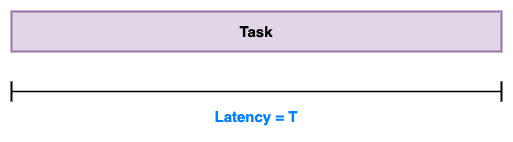
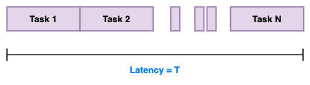
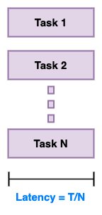

# Performance in Multithreading

There are two main criteria for performance in multithreaded applications:

1. **Latency** - The time to completion of a task. Measured in _time_ units.
2. **Throughput** - The amount of tasks completed in a given period. Measured in _tasks/time_ unit.

## Latency

Suppose we have a single task which can be completed by a single thread sequentially within time T

We can first break the task into multiple independent tasks

Then we can schedule these sub-tasks to run in parallel to each other in different threads,
and theoretically we want to achieve the latency of `T/N` (N = number of sub-tasks).

