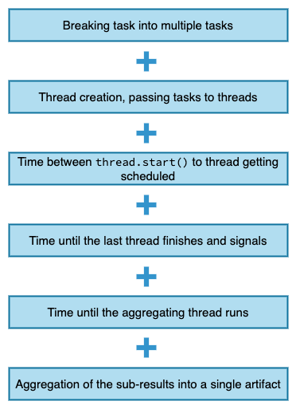
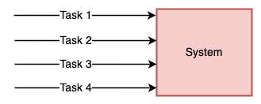

# Performance in Multithreading

There are two main criteria for performance in multithreaded applications:

1. **Latency** - The time to completion of a task. Measured in _time_ units.
2. **Throughput** - The amount of tasks completed in a given period. Measured in _tasks/time_ unit.

# Latency

**How can we make a task multithreaded?**

Suppose we have a single task which can be completed by a single thread sequentially within time T

We can first break the task into multiple independent tasks

Then we can schedule these sub-tasks to run in parallel to each other in different threads,
and theoretically we want to achieve the latency of `T/N` (`N` = number of sub-tasks).

Therefore, we want to do a theoretical reduction in latency by `N` = Performance improvement by a factor of `N`.

## Few important questions

- `N = ?` | How many subtasks/threads to break the original task into?
- Does breaking original task and aggregating results come for free?
- Can we always break any task in multiple subtasks?

### N = ?

On a general purpose computer : `N` should be as close as possible to the number of CPU cores (`N = number of cores`)

**Why?**

Theoretically, if nothing else of significance is running on the same computer, then the OS will do the best it can to
schedule every task in a different core utilizing its hardware the best it can and give us the optimum performance.

> Adding just a single additional thread will be **counter-productive** and in fact will reduce the performance and increase the latency.
>
> That additional thread will keep pushing the other threads from their cores back and forth resulting in
> *context-switches*, *bad cache performance* and *extra memory consumption*.

**Important points**

- `# threads = # cores` is optimal only if all threads are runnable and can run without interruption (no IO / blocking calls / sleep etc.)
- The assumption is that nothing else is running that consumes a lot of CPU.

> More threads than cores is **counter-productive**!

#### Hyper-threading

Most computers today use **Hyper-threading**. It means a single physical core can run more than one thread at a time.

Hyper-threading is a process by which a CPU divides up its **physical cores** into **virtual cores** that are treated as if they are actually physical cores by the OS.

We cannot run all the threads 100% in parallel, but we can get close to that!

**References:**
- https://www.hp.com/us-en/shop/tech-takes/what-is-hyperthreading
- https://www.intel.com/content/www/us/en/gaming/resources/hyper-threading.html

### Inherent cost of Parallelization and Aggregation

### Can we always break any task into multiple subtasks?

The answer is NO!

- Small and trivial tasks are not worth breaking and running in parallel

# Throughput

## When does it matter?

When we have a program that is given a concurrent flow of tasks and want to perform as many tasks as possible, as fast as possible.
In that case **throughput** will be the right performance metric to evaluate the performance of our program.