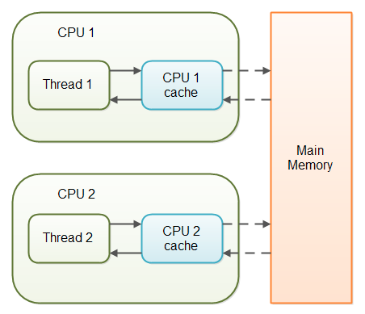
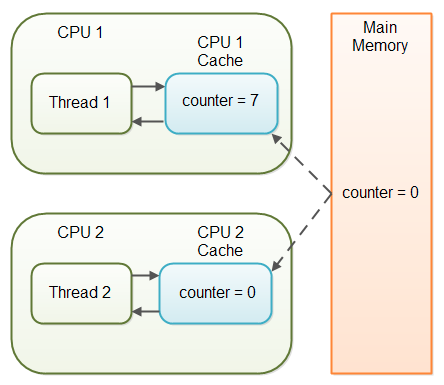

# The `volatile` keyword

_Thanks to Jakob Jenkov. These notes are taken from his website - jenkov.com_

> The Java `volatile` keyword is used to mark a Java variable as "being stored in main memory". More precisely that means, that every read of a `volatile`
> variable will be read from the computer's main memory, and not from the CPU cache, and that every write to a volatile variable will be written to main
> memory, and not just to the CPU cache.


## Variable Visibility Problems

The Java `volatile` keyword guarantees visibility of changes to variables across threads.

In a multithreaded application where the threads operate on non-volatile variables, each thread may copy variables from main memory into a CPU cache while working on them, for performance reasons.
If your computer contains more than one CPU, each thread may run on a different CPU.
That means, that each thread may copy the variables into the CPU cache of different CPUs.



With non-volatile variables there are no guarantees about when the Java Virtual Machine (JVM) reads data from main memory into CPU caches, or writes data from CPU caches to main memory.

Imagine a situation in which two or more threads have access to a shared object which contains a counter variable declared like this:

```java
public class SharedObject {

    public int counter = 0;

}
```

Imagine too, that only Thread 1 increments the `counter` variable, but both Thread 1 and Thread 2 may read the `counter` variable from time to time.

If the counter variable is not declared `volatile` there is no guarantee about when the value of the `counter` variable is written from the CPU cache back to main memory.
This means, that the `counter` variable value in the CPU cache may not be the same as in main memory.



The problem with threads not seeing the latest value of a variable because it has not yet been written back to main memory by another thread, is called a "visibility" problem.
_The updates of one thread are not visible to other threads._


## The Java `volatile` Visibility Guarantee

The Java `volatile` keyword is intended to address variable visibility problems.
By declaring the `counter` variable `volatile` all writes to the `counter` variable will be written back to main memory immediately.
Also, all reads of the `counter` variable will be read directly from the main memory.

Here is how the `volatile` declaration of the `counter` variable looks:

```java
public class SharedObject {

    public volatile int counter = 0;

}
```

Declaring a variable `volatile` thus _guarantees the visibility_ for other threads of writes to that variable.

In the scenario given above, where one thread (T1) modifies the `counter`, and another thread (T2) reads the `counter` (but never modifies it), declaring the `counter` variable `volatile` is enough to guarantee visibility for T2 of writes to the `counter` variable.

If, however, both T1 and T2 were incrementing the counter variable, then declaring the `counter` variable `volatile` would not have been enough.